# Agentic Driven (AD) 1.0

[](https://opensource.org/licenses/MIT)
[](https://github.com/AgenticDriven/agenticdriven)

**Universal methodology for structured AI-assisted development**

AD (Agentic Driven) is a structured methodology for building projects with AI agents. It combines proven engineering practices with AI-first workflows, providing clear phases, exit criteria, and documentation standards.

🌐 **Website**: [agenticdriven.dev](https://agenticdriven.dev)

> [!TIP]
> New to AD? Start with the [Quick Start](#-quick-start) guide below to set up your first project in minutes.

## ✨ Features

- **13 Core Principles** - From Agentic Driven to Proven Solutions First
- **10 Clear Phases** - DEFINE → DISCOVER → DESIGN → SETUP → BUILD → VALIDATE → MARKET → LAUNCH → SUPPORT → EVOLVE
- **Universal** - Works for software, books, marketing, events, products, and more
- **Phase-based Versioning** - `v0.PHASE.ITERATION` format
- **Multi-Agent Ready** - Built-in support for parallel agent collaboration
- **IDE Integrations** - Pre-configured for Cursor, Claude Code, Windsurf, GitHub Copilot, Aider, Continue

## 🚀 Quick Start

> [!TIP]
> Choose the IDE you're already using. All configurations follow the same AD principles.

### 1. Download IDE Configuration

```bash
# For Cursor
curl -sSL https://agenticdriven.dev/download.sh | bash -s cursor

# For Claude Code
curl -sSL https://agenticdriven.dev/download.sh | bash -s claude

# Other IDEs: windsurf, copilot, aider, continue
```

### 2. Initialize Project

```bash
git init
echo "# My Project" > README.md
mkdir -p docs src tests
touch docs/journal.md
git add .
git commit -m "chore: initialize AD project"
```

### 3. Start First Phase

```bash
# Create phase documentation
echo "# DEFINE Phase" > docs/problem-statement.md
# Work on your project following AD principles
git commit -m "feat: define project objectives"
```

## 📚 13 Core Principles

1. **Agent-Driven** - Humans decide strategy, AI executes
2. **Documentation-First** - Document before, during, after
3. **Phased & Structured** - 10 phases with clear objectives and exit criteria
4. **Validation-Driven** - Validate before building and what's built
5. **Iterative** - Improve within phases, document if going back
6. **Traceable** - Every change in git with clear history
7. **Git-First** - Complete + verify = commit immediately
8. **Standards-First** - Prefer rigid standards (Conventional Commits, semver, ISO-8601)
9. **Explicit over Implicit** - No magic numbers/strings, define terms
10. **Single Responsibility** - One component = one purpose
11. **Contract-Driven** - Define specifications before implementation
12. **Test-First** - Define success criteria before starting
13. **Proven Solutions First** - Use established solutions and patterns

## 🔄 10 Phases

```mermaid
graph LR
    A[v0.0.x<br/>DEFINE] --> B[v0.1.x<br/>DISCOVER]
    B --> C[v0.2.x<br/>DESIGN]
    C --> D[v0.3.x<br/>SETUP]
    D --> E[v0.4.x<br/>BUILD]
    E --> F[v0.5.x<br/>VALIDATE]
    F --> G[v0.6.x<br/>MARKET]
    G --> H[v0.7.x<br/>LAUNCH]
    H --> I[v0.8.x<br/>SUPPORT]
    I --> J[v0.9.x<br/>EVOLVE]
    J --> K[v1.0.0<br/>RELEASE]

    style A fill:#e1f5ff
    style B fill:#e1f5ff
    style C fill:#fff4e1
    style D fill:#fff4e1
    style E fill:#e8f5e9
    style F fill:#e8f5e9
    style G fill:#f3e5f5
    style H fill:#f3e5f5
    style I fill:#ffe1e1
    style J fill:#ffe1e1
    style K fill:#ffd700
```



> [!IMPORTANT]
> Each phase has specific exit criteria that must be met before advancing. This ensures quality and prevents rushing through important steps.

| Phase | Version | Description |
|-------|---------|-------------|
| DEFINE | v0.0.x | Define problem, objectives, scope |
| DISCOVER | v0.1.x | Investigate options, viability |
| DESIGN | v0.2.x | Design solution, architecture |
| SETUP | v0.3.x | Prepare tools, environment |
| BUILD | v0.4.x | Build/create solution |
| VALIDATE | v0.5.x | Verify quality, testing |
| MARKET | v0.6.x | Prepare launch materials |
| LAUNCH | v0.7.x | Deploy, activate, go-live |
| SUPPORT | v0.8.x | Maintain, fix issues |
| EVOLVE | v0.9.x | Improve, optimize, grow |
| RELEASE | v1.0.0 | First stable version |

## 🏗️ Project Structure

```
project-root/
├── README.md
├── add.yaml           # Optional, multi-agent only
├── docs/
│   ├── journal.md     # Daily progress log
│   ├── decisions.md   # Architecture Decision Records
│   ├── interfaces.md  # Contracts (multi-agent)
│   └── ...
├── src/               # Adapt by domain
├── tests/             # Adapt by domain
└── assets/            # Optional
```

## 🌍 Universal Domains

> [!NOTE]
> AD adapts to your domain. The phases and principles stay the same, but the terminology and deliverables adjust to your context.

AD 1.0 works for any domain:

- **Software** - Backend, frontend, APIs, mobile apps
- **Books** - Chapters, editing, publishing
- **Marketing** - Campaigns, content, analytics
- **Events** - Planning, logistics, promotion
- **Products** - Design, prototyping, manufacturing
- And more...

## 📖 Documentation

- **[Rules](src/rules/)** - Complete AD 1.0 rules in markdown
- **[IDE Configs](src/rules/ide/)** - Pre-generated IDE configurations
- **[Website](website/)** - Official website source code
- **[Deployment Guide](DEPLOYMENT.md)** - How to deploy the website

## 🤝 Contributing

Contributions are welcome! Please read [CONTRIBUTING.md](CONTRIBUTING.md) before submitting PRs.

- Report bugs via [Issues](https://github.com/AgenticDriven/agenticdriven/issues)
- Suggest features via [Issues](https://github.com/AgenticDriven/agenticdriven/issues)
- Submit improvements via [Pull Requests](https://github.com/AgenticDriven/agenticdriven/pulls)
- Ask questions in [Discussions](https://github.com/AgenticDriven/agenticdriven/discussions)

## 📚 Learn More

- **Books**: Available on [Amazon](https://amazon.com/dp/YOUR-BOOK-ID) (coming soon)
- **Courses**: Available on [Udemy](https://udemy.com/course/YOUR-COURSE-ID) (coming soon)
- **Website**: [agenticdriven.dev](https://agenticdriven.dev)

## 📋 Requirements

> [!NOTE]
> AD is tool-agnostic. Use any AI assistant that works for you.

- Git for version control
- AI IDE (Cursor, Claude Code, Windsurf, etc.) or AI assistant
- Your domain-specific tools (Node.js, Python, etc. for software)

## 🔒 Security

Please report security vulnerabilities to security@agenticdriven.dev or via [private security advisory](https://github.com/AgenticDriven/agenticdriven/security/advisories).

See [SECURITY.md](SECURITY.md) for details.

## 📜 License

This project is licensed under the MIT License - see the [LICENSE](LICENSE) file for details.

## 🙏 Acknowledgments

- Inspired by proven software engineering methodologies
- Built for the AI-first development era
- Community-driven and open source

## 📊 Status

Version: **1.0**
Status: **Active Development**
Last Updated: 2026-01-06

---

**Made with ❤️ for the AD community**

[Website](https://agenticdriven.dev) • [GitHub](https://github.com/AgenticDriven/agenticdriven) • [Issues](https://github.com/AgenticDriven/agenticdriven/issues) • [Discussions](https://github.com/AgenticDriven/agenticdriven/discussions)
